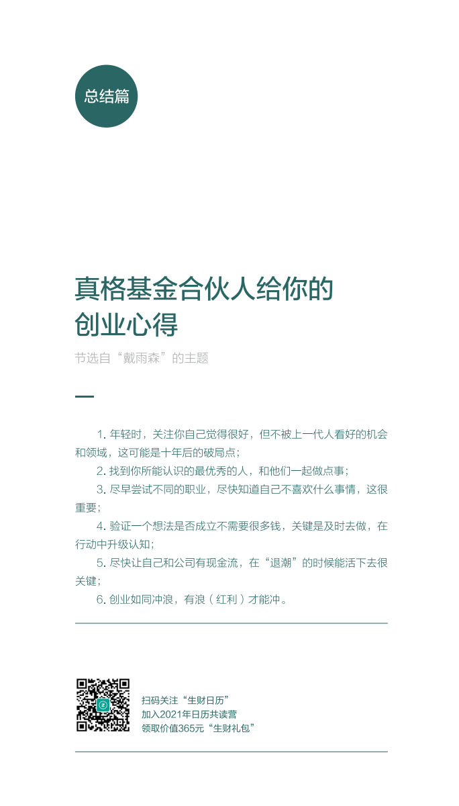

## 共读营的作业  
DAY6：
关键词：链接优秀的人
问题：你身边认识的最优秀的人是谁？你为什么觉得Ta优秀？你是怎样结识的Ta？你在通过什么样的方式和他们链接，是给他们帮点忙，还是一起做一点事？
今天的日历来自真格基金合伙人戴雨森老师，内容见下图。

1. 所在共读营：149 班
2. 微信昵称：MiracleWong
3. 作业内容：
    1. 身边都是同事，不知道他们在其他领域的成就，不做比较
    2. 认识最优秀的人——易仁永澄
    3. 知识系统化，有各种各样的系统工具，教练技术极佳。
    4. 参加他的“年目标指定”课程，之前 2016 年的时候，我是该活动杭州线下活动的组织者，2017 年还组织过线下的“财富游戏”。
    5. 最后：本期的日历的作者——戴雨森（真格基金合伙人）。一个极为优秀的人，他的个人公众号：Violent Delight（the_violent_delight），文章不多，篇篇精品。如《一天读完三本书：我的高效阅读技巧》《Half Life：Alyx 和跨越鸿沟》《从 Instagram 早起创业历程，看优秀创始人的特质》
